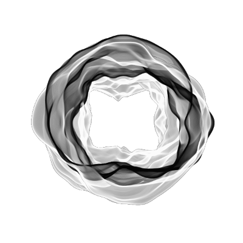

# Project-Laura
*Code-art project to show Laura beautiful things can be made with math and algorithms.*

### These are demos can run in your browser - they're built with [p5.js](https://p5js.org/)

- **morph**: More experiments with `noise()`
  - [demo3](https://michaelruppe.github.io/Project-Laura/morph/03/index.html) - In my opinion, the most visually pleasing demo. Now with *asymmetry*.
  - [demo3](https://michaelruppe.github.io/Project-Laura/morph/03/index.html) - R,G,B entities
  - [demo4](https://michaelruppe.github.io/Project-Laura/morph/04/index.html) - user-sliders for playing with parameters
  - [demo2](https://michaelruppe.github.io/Project-Laura/morph/02/index.html) - symmetric demo with self-erasing tail to prevent things getting too noisy.
  - [demo1](https://michaelruppe.github.io/Project-Laura/morph/01/index.html) - first attempt.

- **flow field** ([demo](https://michaelruppe.github.io/Project-Laura/flow_field/index.html)): Sprinkles particles onto a slowly changing force vector field. The field is updated with perlin noise and the particles trace their trajectory. It procedurally draws images that look something like this:

- **fern** ([demo](https://michaelruppe.github.io/Project-Laura/fern/index.html)): A procedurally generated fractal fern. See [Wiki: Barnsley Fern](https://en.wikipedia.org/wiki/Barnsley_fern)

- **rainy pi** ([demo](https://michaelruppe.github.io/Project-Laura/rainy_pi/index.html)): Count raindrops that fall randomly on a square and a circle with equal "diameter". The ratio of the counts can be used to approximate the value of Pi!

### These are demos built with [Processing](https://processing.org/).
You'll have to download the file/repo to run them.
- [solar system simple](solar_system_simple/): Simulate a solar system with simple physics engine. Elliptical orbits made by calculating velocity for circular orbit then randomly tweaking.

### TODO
My to-do list of projects to attempt.

 - Sun with many planets generated at same point, but orbital velocity is random, centred around circular.
 - Steganography
